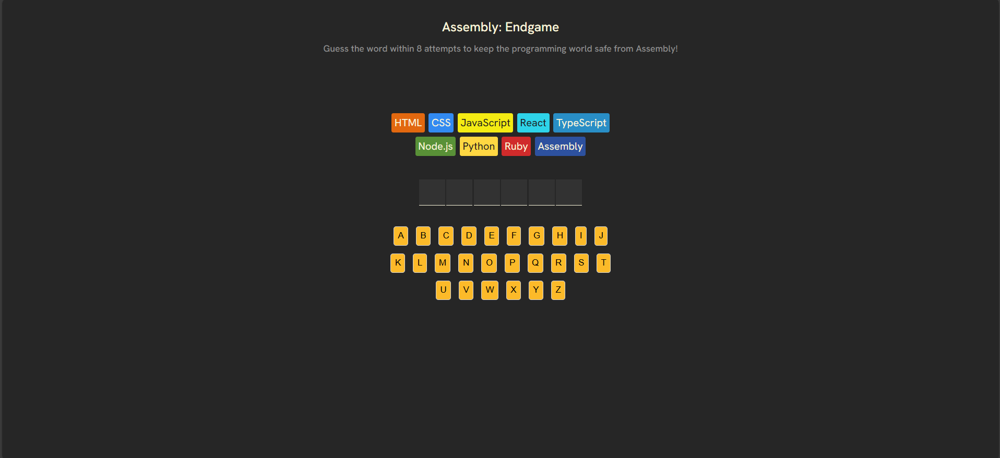

# 🎮 Endgame  

**Endgame** is a fun and interactive word-guessing game inspired by **Hangman**, but with a twist — here, you’re saving **Assembly Language**! ⚔️  

Built with **React.js**, **JavaScript**, **HTML**, and **CSS**, this game also integrates **clsx** for conditional styling and **react-confetti** for a satisfying celebration when you win.  

---

## 🚀 Live Demo  
🔗 [Play Endgame Now](https://endgame-rohan.vercel.app/)  

---

## 📂 Repository  
🔗 [GitHub Repo](https://github.com/Rohan-Adhav/Endgame.git)  

---

## 🖼️ Preview  
  

---

## ✨ Features  
- 🎯 **Classic Hangman twist** – guess the correct word to save Assembly Language.  
- 🎉 **Confetti animation** when you win.  
- ❌ Tracks wrong guesses visually.  
- 🎨 **Responsive UI** designed with clean HTML/CSS.  
- ⚡ Built with **React.js** for smooth interactions.  

---

## 🛠️ Tech Stack  
- **Frontend**: React.js, JavaScript, HTML, CSS  
- **Styling Utility**: clsx  
- **Animation**: react-confetti  

---

## 🕹️ How to Play  
1. The game picks a word randomly.  
2. Start guessing letters!  
3. Each wrong guess gets you closer to losing.  
4. Guess all letters correctly before running out of tries.  
5. Save Assembly Language and celebrate 🎉  

---

## 🏗️ Installation & Setup  
If you’d like to run the project locally:  

```bash
# Clone the repo
git clone https://github.com/Rohan-Adhav/Endgame.git

# Navigate into the project folder
cd Endgame

# Install dependencies
npm install

# Start the development server
npm start
